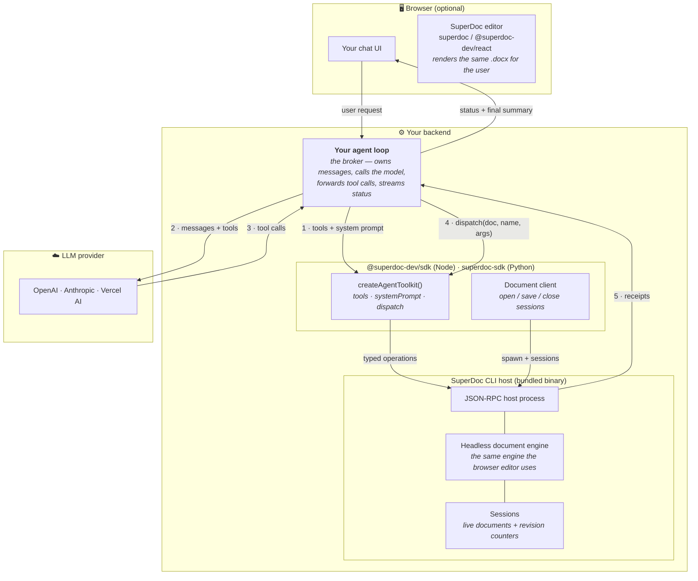
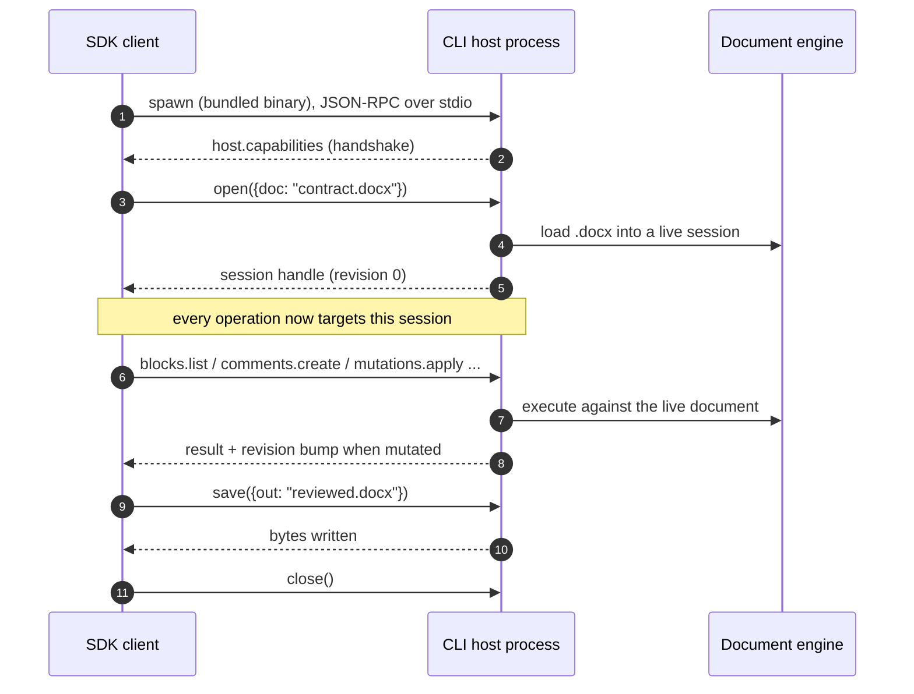
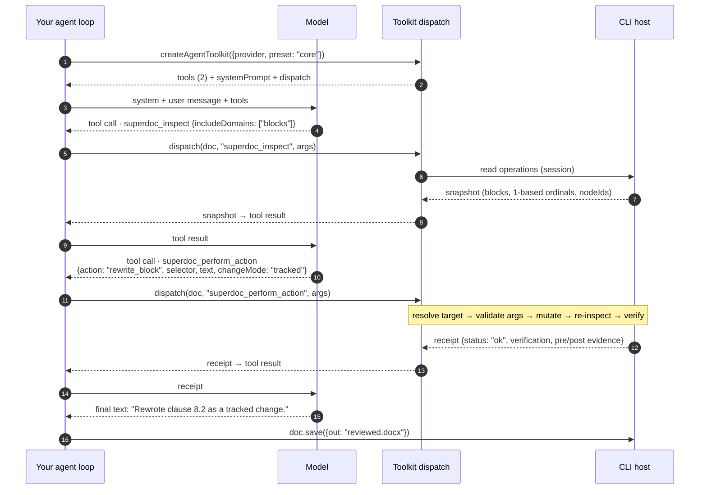

Three layers cooperate to let a model edit Word documents. Nothing here is required reading to get started — the [overview quick start](/ai/agents/llm-tools#quick-start) works without it — but when you're debugging, budgeting tokens, or deciding where code should run, this is the map.

## The big picture

The three rules this diagram encodes:

1. **The SDK is server-side.** `dispatchSuperDocTool` (and the toolkit's `dispatch`) need a session-bound document handle from `createSuperDocClient().open(...)`. Never import the SDK — or the `superdoc` editor package — into browser bundles or Next.js API-route bundling without marking it external.
2. **The model never touches a document.** It only ever sees tool definitions, a system prompt, and tool results. Your loop is the broker for everything.
3. **The engine is the same everywhere.** The CLI host embeds the identical document engine the browser editor uses — edits made headless render exactly the same in the editor.

## SDK ↔ CLI: where documents actually live

The SDK packages are deliberately thin: typed clients, the tool surfaces, and prompts. The document engine ships inside the **CLI host binary** (`@superdoc-dev/cli-<platform>` for Node, an embedded companion in the Python wheels).

What crosses this boundary, precisely:

- **Transport**: newline-delimited JSON-RPC on stdio. One host process serves many sequential requests; sessions keep documents live between calls, which is what makes multi-step agent edits fast.
- **Validation**: every operation's input is validated against the generated contract *inside the host* before it touches the document — a malformed tool call fails loudly with a coded error, never half-applies.
- **Revisions**: the host keeps a per-session revision counter (starts at 0, +1 per mutation). `--expected-revision` / optimistic-concurrency guards compare against this counter. Receipts additionally carry the engine's own revision string for before/after evidence.
- **Tracked changes**: `changeMode: "tracked"` rides the operation into the engine, which records real OOXML revisions (`w:ins`, `w:del`, `w:pPrChange`) — the same marks Word shows.

If the host can't start, everything surfaces as `Host process disconnected` — the [troubleshooting checklist](/ai/agents/llm-tools#troubleshooting-host-process-disconnected) walks the causes (Gatekeeper, Node version, bundler).

## LLM ↔ SDK: one tool call, end to end

The model's entire world is `tools` + `systemPrompt` + tool results. Here's a complete round trip for "rewrite the termination clause as a tracked change" on the core preset:

Three properties worth internalizing:

- **The static prefix repeats every turn.** Tools + system prompt are re-sent on each model call and every tool result stays in history — this is why the [token budget](/ai/agents/llm-tools#token-budget) section exists, and why Anthropic callers should enable prompt caching.
- **Receipts are the feedback loop.** The model self-corrects from `status`, `verification`, and `errors[].message` — which is why core-preset receipts carry evidence rather than a bare "ok", and why streaming them to your UI gives users meaningful progress for free.
- **Dispatch is the security boundary you control.** The toolkit's pre-bound `dispatch` enforces the preset and `excludeActions` no matter what the model asks for.

## Where Python and MCP fit

- **Python** is the same architecture with the same binary: `superdoc-sdk` talks to the CLI host embedded in its platform wheel (or `SUPERDOC_CLI_BIN`). The core preset's tools, prompt, and dispatch are proxied through the host, so both languages expose byte-identical surfaces.
- **MCP** is an alternative front door for MCP clients (Claude Desktop, IDEs): the `superdoc-mcp` server embeds the document engine in-process and registers either preset's tools (`MCP_PRESET=core`) plus session lifecycle tools. Same engine, same actions — no agent loop of your own required.

## Related

- [Overview & agent loops](/ai/agents/llm-tools)
- [Core preset reference](/ai/agents/core-preset)
- [Legacy preset reference](/ai/agents/legacy-preset)
- [Document API](/document-api/overview) — the operation contract the SDK speaks
