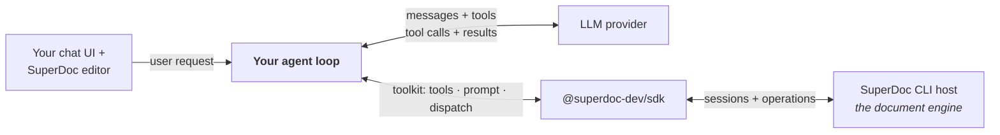

The SuperDoc SDK ships tool definitions that give LLMs structured access to document operations: reading, searching, editing, formatting, lists, tables, comments, and tracked changes. Pick a provider format, pass the tools to your model, dispatch the calls, and the SDK handles schema formatting, argument validation, and execution.

## How the pieces fit



Your loop is the broker: the model only ever sees tools, a system prompt, and tool results; documents live in sessions inside the CLI host the SDK spawns; the browser editor renders the same file for the user. Three rules prevent most first-hour confusion:

1. **The SDK is server-side** — `dispatch` needs a session-bound handle from `createSuperDocClient().open(...)`; it does not run in the browser.
2. **The editor is browser-side** — never import `superdoc` / `@superdoc-dev/react` in backend code or API routes.
3. **Pair everything from one preset** — tools, system prompt, and dispatch must come from the same preset (the toolkit guarantees this).

<Note>
The full mechanics — what crosses the SDK ↔ CLI boundary, sessions and revisions, a complete tool-call round trip with sequence diagrams, and where Python and MCP fit — have their own page: **[How it works](/ai/agents/architecture)**.
</Note>

## Two presets

The SDK ships two tool surfaces. Pass the same `preset` to `chooseTools`, `getSystemPrompt`, and `dispatchSuperDocTool`.

| | `legacy` (default) | `core` |
| --- | --- | --- |
| Surface | 10 grouped intent tools (`superdoc_edit`, `superdoc_search`, …) | 2 tools: `superdoc_inspect` + `superdoc_perform_action` (40 named actions) |
| Style | Low-level: search for handles, then edit by address | High-level: named product verbs with deterministic targeting |
| Results | Operation results | Receipts with pre/post evidence and verification |
| Tracked changes | Via `changeMode` on individual ops | First-class: every mutating action is redline-aware, plus accept/reject/undo/redo actions |
| Best for | Fine-grained control, existing integrations | Agent loops, review/redlining workflows, fastest correct results |

<Note>
**Use the core preset for new integrations.** Legacy remains the default only for backwards compatibility — existing integrations keep working unchanged. Core scores measurably higher on our revision-fidelity evals and returns verifiable receipts. Each preset has its own reference page: [core](/ai/agents/core-preset) · [legacy](/ai/agents/legacy-preset).
</Note>

Both presets are also served over **MCP**: the SuperDoc MCP server registers the legacy intent tools by default, or the core action surface with `MCP_PRESET=core` (two tools plus session lifecycle, with the core MCP instructions).

## Quick start

Install the SDK, create a client, open a document, and wire up an agentic loop.

<Tabs>
  <Tab title="Node.js">
    ```bash
    npm install @superdoc-dev/sdk openai
    ```

    ```typescript
    import { createSuperDocClient, createAgentToolkit } from '@superdoc-dev/sdk';
    import OpenAI from 'openai';

    const client = createSuperDocClient();
    await client.connect();
    const doc = await client.open({ doc: './contract.docx' });

    // One call — tools, system prompt, and dispatch, guaranteed coherent.
    const { tools, systemPrompt, dispatch } = await createAgentToolkit({
      provider: 'openai',
      preset: 'core',
    });
    const openai = new OpenAI();

    const messages: OpenAI.Chat.Completions.ChatCompletionMessageParam[] = [
      { role: 'system', content: systemPrompt },
      { role: 'user', content: 'Find the termination clause and rewrite it to allow 30-day notice. Use tracked changes.' },
    ];

    while (true) {
      const response = await openai.chat.completions.create({
        model: 'gpt-5.4',
        messages,
        tools,
      });

      const message = response.choices[0].message;
      messages.push(message);

      if (!message.tool_calls?.length) break;

      for (const call of message.tool_calls) {
        const result = await dispatch(doc, call.function.name, JSON.parse(call.function.arguments));
        messages.push({
          role: 'tool',
          tool_call_id: call.id,
          content: JSON.stringify(result),
        });
      }
    }

    await doc.save({ inPlace: true });
    await doc.close();
    await client.dispose();
    ```
  </Tab>
  <Tab title="Python">
    ```bash
    pip install superdoc-sdk openai
    ```

    <Note>The PyPI package is `superdoc-sdk`, but the import is `from superdoc import …` — `import superdoc_sdk` will raise `ModuleNotFoundError`.</Note>

    ```python
    import json
    from openai import OpenAI
    from superdoc import SuperDocClient, create_agent_toolkit

    client_llm = OpenAI()  # uses OPENAI_API_KEY env var
    client = SuperDocClient()
    client.connect()
    doc = client.open({"doc": "./contract.docx"})

    # One call — tools, system prompt, and dispatch, guaranteed coherent.
    kit = create_agent_toolkit({"provider": "openai", "preset": "core"})
    tools, system_prompt = kit["tools"], kit["system_prompt"]

    messages = [
        {"role": "system", "content": system_prompt},
        {"role": "user", "content": "Find the termination clause and rewrite it to allow 30-day notice. Use tracked changes."},
    ]

    while True:
        response = client_llm.chat.completions.create(
            model="gpt-5.4", messages=messages, tools=tools
        )
        message = response.choices[0].message
        messages.append(message)

        if not message.tool_calls:
            break

        for call in message.tool_calls:
            result = kit["dispatch"](doc, call.function.name, json.loads(call.function.arguments))
            messages.append({
                "role": "tool",
                "tool_call_id": call.id,
                # Receipts may contain non-JSON-serializable values; default=str is safe.
                "content": json.dumps(result, default=str),
            })

    doc.save({"inPlace": True})
    doc.close({})
    client.dispose()
    ```
  </Tab>
</Tabs>

## Tool selection

The one-call setup — tools, system prompt, and a pre-bound dispatcher that always agree on preset and exclusions:

<Tabs>
  <Tab title="Node.js">
    ```typescript
    import { createAgentToolkit } from '@superdoc-dev/sdk';

    const { tools, systemPrompt, dispatch, meta } = await createAgentToolkit({
      provider: 'openai',
      preset: 'core',
      excludeActions: ['delete_table'],   // applied to tools, prompt, AND dispatch
    });

    // in the loop:
    const receipt = await dispatch(doc, call.function.name, JSON.parse(call.function.arguments));
    ```
  </Tab>
  <Tab title="Python">
    ```python
    from superdoc import create_agent_toolkit

    kit = create_agent_toolkit({"provider": "openai", "preset": "core",
                                "excludeActions": ["delete_table"]})
    tools, system_prompt = kit["tools"], kit["system_prompt"]

    receipt = kit["dispatch"](doc, call.function.name, json.loads(call.function.arguments))
    # async loops: kit["dispatch_async"](...)
    ```
  </Tab>
</Tabs>

The toolkit makes preset/exclusion mismatches impossible by construction — an excluded action is simultaneously out of the tool enum, out of the system prompt, and refused at dispatch. The standalone functions below remain available when you need the pieces individually; if you use them with `excludeActions`, pass the **same list to all three**.

`chooseTools()` returns provider-formatted tool definitions plus metadata about the selection.

<Tabs>
  <Tab title="Node.js">
    ```typescript
    import { chooseTools } from '@superdoc-dev/sdk';

    const { tools, meta } = await chooseTools({
      provider: 'openai',   // 'openai' | 'anthropic' | 'vercel' | 'generic'
      preset: 'core',       // omit for the default 'legacy' surface
    });

    // meta = { preset: 'core', provider: 'openai', toolCount: 2, cacheStrategy: 'disabled' }
    // cacheStrategy: 'disabled' | 'explicit' | 'automatic' | 'unsupported' —
    // this call returns 'disabled'; anthropic with cache: true returns 'explicit'.
    ```
  </Tab>
  <Tab title="Python">
    ```python
    from superdoc import choose_tools

    result = choose_tools({"provider": "openai", "preset": "core"})
    tools = result["tools"]
    meta = result["meta"]   # preset, provider, toolCount, cacheStrategy
    ```
  </Tab>
</Tabs>

## Legacy tool catalog

The legacy preset's 10 grouped intent tools, their behaviors (`superdoc_search` `require` semantics, ref expiry, `superdoc_mutations` batching), and the migration mapping to core actions now live on the [legacy preset page](/ai/agents/legacy-preset).

## Dispatching tool calls

`dispatchSuperDocTool()` resolves a tool name to the correct SDK method, validates arguments, and executes the call against a bound document handle.

<Tabs>
  <Tab title="Node.js">
    ```typescript
    import { dispatchSuperDocTool } from '@superdoc-dev/sdk';

    const result = await dispatchSuperDocTool(doc, toolName, args, { preset: 'core' });
    ```
  </Tab>
  <Tab title="Python (sync)">
    ```python
    from superdoc import dispatch_superdoc_tool

    result = dispatch_superdoc_tool(doc, tool_name, args, preset="core")
    ```
  </Tab>
  <Tab title="Python (async)">
    ```python
    from superdoc import dispatch_superdoc_tool_async

    result = await dispatch_superdoc_tool_async(doc, tool_name, args, preset="core")
    ```
  </Tab>
</Tabs>

The dispatcher validates required parameters, rejects unknown arguments, and throws descriptive errors the LLM can act on. `doc` must be the session-bound handle from `client.open(...)` — a plain object or a browser editor instance will not work.

## System prompt

`getSystemPrompt(preset?)` returns the prompt each tool surface was designed — and evaluated — with. It teaches the model the document vocabulary the tools use (blocks, ordinals, markers, visual sections), when to inspect before editing, how to read results, and the tracked-changes rules.

<Tabs>
  <Tab title="Node.js">
    ```typescript
    import { getSystemPrompt } from '@superdoc-dev/sdk';

    const legacyPrompt = await getSystemPrompt();        // legacy surface
    const corePrompt = await getSystemPrompt('core');    // action surface
    ```
  </Tab>
  <Tab title="Python">
    ```python
    from superdoc import get_system_prompt

    core_prompt = get_system_prompt("core")
    ```
  </Tab>
</Tabs>

Guidance:

- **Use it as-is** as your system message, or as the first section of one.
- **Extend, don't replace**: append your product's instructions (tone, guardrails, domain language) after it. The prompt's tool-usage sections encode behavior the schemas alone can't teach; dropping it measurably degrades edit quality.
- Pair prompt and tools from the **same preset** — the prompt documents exactly the surface the model was given.

## Provider formats

Each provider gets tool definitions in its native format:

<Tabs>
  <Tab title="OpenAI">
    ```typescript
    const { tools } = await chooseTools({ provider: 'openai', preset: 'core' });
    // [{ type: 'function', function: { name, description, parameters } }]
    ```
  </Tab>
  <Tab title="Anthropic">
    ```typescript
    const { tools } = await chooseTools({ provider: 'anthropic', preset: 'core', cache: true });
    // [{ name, description, input_schema }]
    // With cache: true, the last tool carries cache_control for prompt caching
    // (see Token budget). Without it, no cache markers are added.
    ```
  </Tab>
  <Tab title="Vercel AI">
    ```typescript
    const { tools } = await chooseTools({ provider: 'vercel', preset: 'core' });
    // [{ name, description, inputSchema }] — AI SDK dialect
    ```
  </Tab>
  <Tab title="Generic">
    ```typescript
    const { tools } = await chooseTools({ provider: 'generic', preset: 'core' });
    // [{ name, description, parameters }]
    ```
  </Tab>
</Tabs>

<Warning>
**Agent loops are not provider-interchangeable.** The tool *definitions* adapt automatically, but the message protocol does not: OpenAI uses `message.tool_calls` + `role: "tool"` replies; Anthropic uses `tool_use` content blocks + `role: "user"` messages containing `tool_result` blocks. Budget for a per-provider loop — the Anthropic variant is below.
</Warning>

### Anthropic loop

<Tabs>
  <Tab title="Node.js">
    ```typescript
    import Anthropic from '@anthropic-ai/sdk';
    import { chooseTools, getSystemPromptForProvider, dispatchSuperDocTool } from '@superdoc-dev/sdk';

    const anthropic = new Anthropic();
    // cache: true on both halves of the static prefix — the tool array and the
    // system prompt — so Anthropic caches them across turns (see Token budget).
    const { tools } = await chooseTools({ provider: 'anthropic', preset: 'core', cache: true });
    const sys = await getSystemPromptForProvider({ provider: 'anthropic', preset: 'core', cache: true });

    const messages: Anthropic.MessageParam[] = [
      { role: 'user', content: 'Rewrite the termination clause for 30-day notice, tracked.' },
    ];

    while (true) {
      const response = await anthropic.messages.create({
        model: 'claude-sonnet-5',
        max_tokens: 4096,
        system: sys.content, // text blocks carrying cache_control markers
        tools,
        messages,
      });
      messages.push({ role: 'assistant', content: response.content });

      const toolUses = response.content.filter((block) => block.type === 'tool_use');
      if (toolUses.length === 0) break;

      const results = [];
      for (const use of toolUses) {
        const result = await dispatchSuperDocTool(doc, use.name, use.input, { preset: 'core' });
        results.push({ type: 'tool_result', tool_use_id: use.id, content: JSON.stringify(result) });
      }
      messages.push({ role: 'user', content: results });
    }
    ```
  </Tab>
  <Tab title="Python">
    ```python
    import json
    import anthropic
    from superdoc import choose_tools, get_system_prompt, dispatch_superdoc_tool

    client_llm = anthropic.Anthropic()
    tools = choose_tools({"provider": "anthropic", "preset": "core", "cache": True})["tools"]
    # The Node SDK wraps this in getSystemPromptForProvider; in Python, build
    # the cacheable system block directly:
    system = [{
        "type": "text",
        "text": get_system_prompt("core"),
        "cache_control": {"type": "ephemeral"},
    }]

    messages = [{"role": "user", "content": "Rewrite the termination clause for 30-day notice, tracked."}]

    while True:
        response = client_llm.messages.create(
            model="claude-sonnet-5", max_tokens=4096,
            system=system, tools=tools, messages=messages,
        )
        messages.append({"role": "assistant", "content": response.content})

        tool_uses = [b for b in response.content if b.type == "tool_use"]
        if not tool_uses:
            break

        results = []
        for use in tool_uses:
            result = dispatch_superdoc_tool(doc, use.name, use.input, preset="core")
            results.append({
                "type": "tool_result",
                "tool_use_id": use.id,
                "content": json.dumps(result, default=str),
            })
        messages.append({"role": "user", "content": results})
    ```
  </Tab>
</Tabs>

## Token budget

Tool schemas and the system prompt are re-sent on **every** turn, and every tool result lives in conversation history forever. Untended, a typical loop crosses low-tier per-minute token ceilings within a few turns. What the SDK gives you and what to do yourself:

- **Prompt caching (Anthropic)** — pass `cache: true` to `chooseTools({ provider: 'anthropic', cache: true, ... })`: the SDK marks the tool array with `cache_control: {type: 'ephemeral'}` so the static prefix is cached across turns (~90% cost reduction on the cached portion). For the other half of the prefix, `getSystemPromptForProvider({ provider: 'anthropic', cache: true })` returns the system prompt as cacheable system blocks — pass its `content` as the `system` parameter (the [Anthropic loop](#anthropic-loop) shows both together).
- **Narrow the surface** — `excludeActions` (core preset) removes actions from the schema *and* the prompt in one move.
- **Windowed reads** — on large documents, inspect in block windows (`blockOffset`/`blockLimit`) instead of pulling the whole document into history; with legacy `superdoc_get_content action:"text"`, be aware the full text lands in history on every use.
- **Receipts are pre-capped** — core-preset receipts cap long per-item lists at 8 entries with count fields, specifically to keep history lean.
- **Plan for 429s** — tier-1 accounts should implement exponential backoff and history truncation from day one.

## Error codes

Runtime errors carry a stable `code` your loop (and your model) can branch on:

| Code | Meaning | Recoverable? |
| --- | --- | --- |
| `REVISION_MISMATCH` | A ref/handle from before a mutation was used after it (legacy) or the session revision guard failed | Yes — re-search / re-inspect and retry |
| `AMBIGUOUS_MATCH` | `exactlyOne` matched several occurrences | Yes — narrow the pattern or use `all` |
| `MATCH_NOT_FOUND` | Target text/element not found; **nothing was changed** | Yes — re-inspect, fix the target |
| `INVALID_ARGUMENT` / `INVALID_INPUT` | Bad or unknown arguments (includes actions excluded by configuration) | Fix the call |
| `TOOL_DISPATCH_NOT_FOUND` | Tool name unknown to the selected preset | Fix preset/tool pairing |
| `TOOLS_ASSET_NOT_FOUND` / `TOOLS_ASSET_UNREADABLE` | Bundled prompt asset missing vs. unreadable (IO/permissions — details carry the cause) | Environment issue |
| `HOST_HANDSHAKE_FAILED` | CLI host binary could not start | No — fix the environment (see below) |

Core-preset action failures additionally return structured `recovery` hints (`reinspect` / `retry` / `revert` with a paste-ready call) inside the receipt.

## Troubleshooting: `Host process disconnected`

This one error has several distinct causes — check in order:

1. **macOS Gatekeeper killed the unsigned binary** (SIGKILL at launch). Check `xattr -d com.apple.quarantine <binary>` / your MDM policy.
2. **Unsupported Node version** — the SDK supports current LTS versions, but doesn't declare `engines`, so npm won't warn you at install time. Check `node --version` first.
3. **The host crashed mid-call** — enable transport debug logs (`DEBUG=superdoc.transport`) to see the host's stderr and exit code.
4. **Next.js bundling** — mark the SDK as external (`serverExternalPackages: ['@superdoc-dev/sdk']`) so the native binary isn't bundled away.

## Streaming status to your UI

The agent loop is the natural place to emit progress events — each tool call is a meaningful step. Server-sent events sketch:

```typescript
// Express/Node SSE endpoint around the agent loop
for (const call of message.tool_calls) {
  const args = JSON.parse(call.function.arguments);
  send({ type: 'tool_start', tool: call.function.name, action: args.action ?? null });

  const receipt = (await dispatchSuperDocTool(doc, call.function.name, args, {
    preset: 'core',
  })) as { status?: string; verificationPassed?: boolean };

  send({
    type: 'tool_done',
    tool: call.function.name,
    action: args.action ?? null,
    status: receipt.status ?? 'ok',         // core receipts: ok | partial | failed
    verified: receipt.verificationPassed ?? null,
  });
  messages.push({ role: 'tool', tool_call_id: call.id, content: JSON.stringify(receipt) });
}
send({ type: 'assistant_message', text: finalText });
```

Core-preset receipts make the events meaningful for users: `action` names read like product verbs ("replace_text", "add_comments"), and `status`/`verified` let you render success/warning states without parsing prose. For the final message, instruct the model (in your appended system-prompt section) to end with a short user-facing summary of what changed — receipts give it the evidence to be specific.

## Creating custom tools

Custom capabilities are documented per preset:

- **Core preset** — [Creating custom actions](/ai/agents/core-preset#creating-custom-actions): the `defineAction` authoring kit (coming soon).
- **Legacy preset** — [Creating custom tools](/ai/agents/legacy-preset#creating-custom-tools): define provider tools that call `doc.*` operations and merge them with the SDK's.

## SDK functions

| Function | Description |
| --- | --- |
| `createAgentToolkit(input)` | One call: coherent `{tools, systemPrompt, dispatch, meta}` for a preset (recommended) |
| `chooseTools(input)` | Load tool definitions for a provider (`preset`, `excludeActions`, `cache` options) |
| `dispatchSuperDocTool(doc, name, args, options?)` | Execute a tool call against a bound document handle |
| `listTools(provider, preset?)` | List all tool definitions for a provider |
| `getToolCatalog(preset?)` | Load the full tool catalog with metadata |
| `getSystemPrompt(preset?, options?)` | Read the bundled system prompt for a tool surface |
| `getSystemPromptForProvider(input)` | System prompt shaped for a provider — for `anthropic` with `cache: true`, returns system blocks carrying `cache_control` (Node only; in Python build the block from `get_system_prompt`) |

## Related

- [How it works](/ai/agents/architecture): SDK ↔ CLI ↔ LLM mechanics with sequence diagrams
- [Core preset reference](/ai/agents/core-preset): the two-tool action surface, all 40 actions, receipts, redlining
- [Legacy preset reference](/ai/agents/legacy-preset): the previous 10-tool surface (not recommended for new work)
- [How to use](/ai/agents/integrations): step-by-step integration guide with copy-pasteable code
- [Best practices](/ai/agents/best-practices): prompting, workflow tips, and tested prompt examples
- [Debugging](/ai/agents/debugging): troubleshoot tool call failures
- [SDKs](/document-engine/sdks): typed Node.js and Python wrappers
- [Document API](/document-api/overview): the operation set behind the tools
