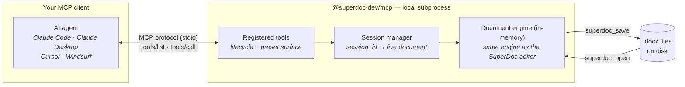
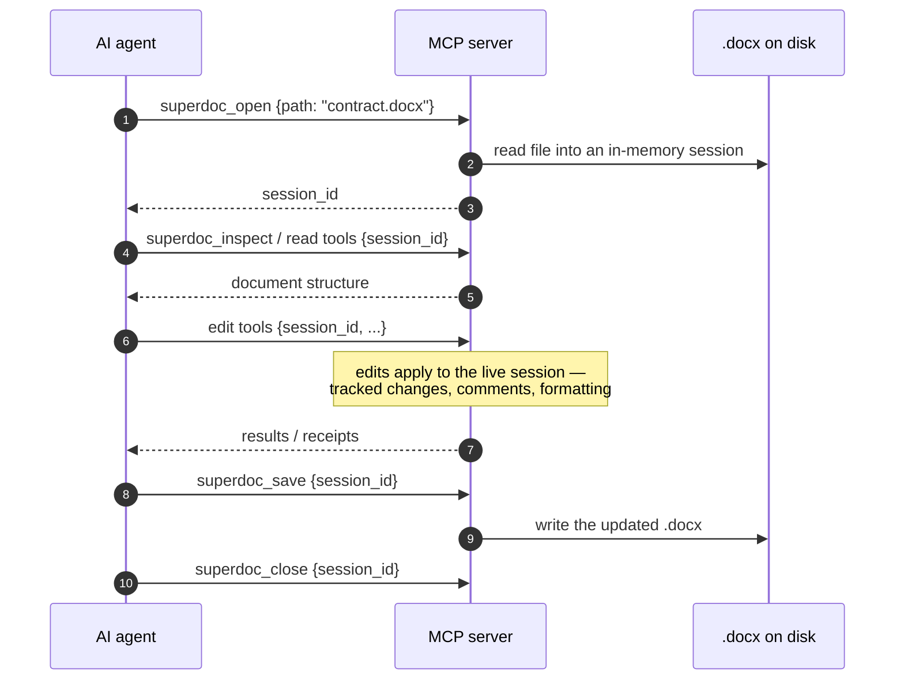

The SuperDoc MCP server lets AI agents open, read, edit, and save `.docx` files. It exposes the same operations as the [Document API](/document-api/overview) through the [Model Context Protocol](https://modelcontextprotocol.io): the open standard for connecting AI tools to agents.

## How it works

Your MCP client spawns the server as a local subprocess and talks to it over stdio. The server embeds the SuperDoc document engine — the same engine the browser editor uses — and manages documents as in-memory **sessions**: `superdoc_open` loads a file and returns a `session_id`, every tool call targets that session, and nothing touches disk until `superdoc_save`.



A typical conversation, end to end:



Everything runs locally — SuperDoc never uploads your files. The AI agent you connect still sends document content to its own model provider as tool results.

## Setup

Install once. Your MCP client spawns the server automatically on each conversation.

<Tabs>
  <Tab title="Claude Code">
    ```bash
    claude mcp add superdoc -- npx @superdoc-dev/mcp
    ```
  </Tab>
  <Tab title="Claude Desktop">
    Add to `~/Library/Application Support/Claude/claude_desktop_config.json`:

    ```json
    {
      "mcpServers": {
        "superdoc": {
          "command": "npx",
          "args": ["@superdoc-dev/mcp"]
        }
      }
    }
    ```
  </Tab>
  <Tab title="Cursor">
    Add to `~/.cursor/mcp.json`:

    ```json
    {
      "mcpServers": {
        "superdoc": {
          "command": "npx",
          "args": ["@superdoc-dev/mcp"]
        }
      }
    }
    ```
  </Tab>
  <Tab title="Windsurf">
    Add to `~/.codeium/windsurf/mcp_config.json`:

    ```json
    {
      "mcpServers": {
        "superdoc": {
          "command": "npx",
          "args": ["@superdoc-dev/mcp"]
        }
      }
    }
    ```
  </Tab>
</Tabs>

## Tools

The server registers one of two tool surfaces, selected by the `MCP_PRESET` environment variable. All tools except `superdoc_open` take a `session_id` from `superdoc_open`.

| | Default (`legacy`) | `MCP_PRESET=core` — recommended |
| --- | --- | --- |
| Tools | 13: lifecycle + 10 grouped intent tools | 5: lifecycle + `superdoc_inspect` + `superdoc_perform_action` (40 named actions) |
| Style | Low-level: search for handles, edit by address | High-level verbs with deterministic targeting and verifiable receipts |
| Reference | tables below | [core preset reference](/ai/agents/core-preset) |

To use the core surface, add the env to your client config:

```json
{
  "mcpServers": {
    "superdoc": {
      "command": "npx",
      "args": ["@superdoc-dev/mcp"],
      "env": { "MCP_PRESET": "core" }
    }
  }
}
```

### Lifecycle

| Tool | Input | Description |
| --- | --- | --- |
| `superdoc_open` | `path` | Open a `.docx` file. Returns `session_id` and file path |
| `superdoc_save` | `session_id`, `out?` | Save to the original path, or to `out` if specified |
| `superdoc_close` | `session_id` | Close the session. Unsaved changes are lost |

### Intent tools

<Note>
These are the **legacy preset's** tools (the default surface). With `MCP_PRESET=core` the server registers `superdoc_inspect` and `superdoc_perform_action` instead — see the [core preset reference](/ai/agents/core-preset) for its 40 actions, selectors, and receipts.
</Note>

| Tool | Actions | Description |
| --- | --- | --- |
| `superdoc_get_content` | `text`, `markdown`, `html`, `blocks`, `extract`, `info` | Read document content in different formats |
| `superdoc_search` | _(single action)_ | Find text or nodes and return handles or addresses for later edits |
| `superdoc_edit` | `insert`, `replace`, `delete`, `undo`, `redo` | Perform text edits and history actions |
| `superdoc_format` | `inline`, `set_style`, `set_alignment`, `set_indentation`, `set_spacing`, `set_direction`, `set_flow_options` | Apply inline or paragraph formatting |
| `superdoc_create` | `paragraph`, `heading`, `table` | Create structural block elements |
| `superdoc_list` | `insert`, `create`, `attach`, `detach`, `delete`, `merge`, `split`, `indent`, `outdent`, `set_level`, `set_type`, `set_value`, `continue_previous` | Create and manipulate lists |
| `superdoc_comment` | `create`, `update`, `delete`, `get`, `list` | Manage comment threads |
| `superdoc_track_changes` | `list`, `decide` | Review and resolve tracked changes |
| `superdoc_mutations` | `preview`, `apply` | Execute multi-step atomic edits as a batch |
| `superdoc_table` | `delete`, `delete_column`, `delete_row`, `insert_column`, `insert_row`, `merge_cells`, `set_borders`, `set_cell`, `set_cell_text`, `set_column`, `set_layout`, `set_options`, `set_row`, `set_row_options`, `set_shading`, `set_style_options`, `unmerge_cells` | Modify table structure, content, and styling |

Multi-action tools use an `action` argument to select the underlying operation. `superdoc_search` is a single-action tool and does not require `action`.

## Related

- [How to use](/ai/mcp/how-to-use): workflow patterns, targeting, and common operations
- [Debugging](/ai/mcp/debugging): inspect and troubleshoot MCP tool calls
- [LLM Tools](/ai/agents/llm-tools): build custom LLM integrations with the SDK
- [CLI](/document-engine/cli): edit documents from the terminal
